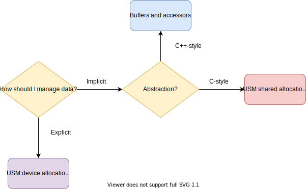

.. _buffer-accessor-vs-usm:

Buffer-accessor model *vs* unified shared memory
================================================

.. questions::

   - When should I use the buffer-accessor model and when is :term:`USM` more appropriate?

.. objectives::

   - Learn the trade-offs of the buffer-accessor and :term:`USM` models.

In episodes :ref:`buffers-accessors` and :ref:`unified-shared-memory`, we saw
what the current SYCL standard has to offer in terms of data management models.
Some of the exercises showed how to implement the same task using both models.
What is the "best" strategy? The answer is, unsurprinsingly, **"it depends"**.
The question should rather be: would you like the runtime to manage data
transfers or do you want to be fully in control?  The following chart offers a
guide to inform a decision between the two models.

    Choosing between the USM and buffer-accessor model in SYCL. The fundamental
    question is how comfortable we are with the runtime managing data movement
    for us.

The chart does not take into consideration whether or not we are working with an
established codebase. If that is the case, USM, which is a pointer-based approach,
might provide an easier porting path to SYCL.

.. note::

   Why can't we use *both* models in the same application? The current standard
   *does not* describe how to achieve interoperability between buffers and
   USM-allocated memory. This might lead to unnecessary copies and degraded
   performance and the even more unfortunate consequence that, once a data
   management model is chosen, the application is effectively locked into it
   forever. Future SYCL standards might remedy this situation. In the meantime,
   hipSYCL *does offer* buffer-USM interoperability as an extension to the
   standard:
   https://hipsycl.github.io/hipsycl/extension/hipsycl-091-buffer-usm-interop/

.. exercise:: Porting the heat equation mini-app to SYCL

   As a last assignment for this workshop, we'll port the heat equation mini-app
   introduced in the previous episode.
   You are free to choose either the buffer/accessor or the USM model for your
   port.
