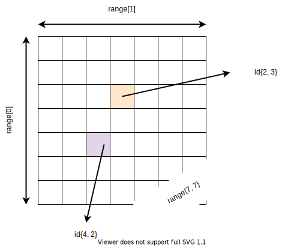
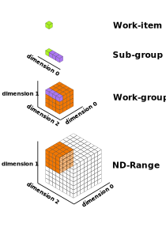

.. _expressing-parallelism:

Expressing parallelism with SYCL
================================

.. questions::

   - How do we write parallel kernels in SYCL_?

.. objectives::

   - Learn the difference between *task* and *data* parallelism.
   - Learn about *work-items*, *work-groups*, and *nd-ranges*.

We should have acquired a good enough understanding of the anatomy of a SYCL
program: queues, kernels, and memory management strategies. We have, however,
not really discussed about strategies for *expressing parallelism* in a SYCL
program. Indeed, the kernels that we have seen and written so far in the exercises
always used a 1-dimensional work distribution, exemplified by the use of
``range<1>`` and ``id<1>`` objects as arguments of ``parallel_for`` and the
kernel lambdas, respectively.
Our particular problem domain might have additional structure and our program
might benefit, in terms of performance, from exploiting it.

Data and task parallelism [*]_
------------------------------

The are two types of parallelism that can be explored and exploited:

Data parallelism
  The data can be distributed across computational units that can run in
  parallel.  Each unit processes the data applying the same or very similar
  operations to different data elements.  A common example is applying a blur
  filter to an image: the same function is applied to *all* the pixels the
  image is made of.  This parallelism is natural for the GPU, where the same
  instruction set is executed in multiple threads.
Task parallelism
  When an application consists of many tasks that perform different operations
  with (the same or) different data. An example of task parallelism is cooking:
  slicing vegetables and grilling are very different tasks and can be done at
  the same time, if more cooks are available.  Note that the tasks can consume
  totally different resources, for example a CPU and a GPU, adding yet another
  dimension for performance optimization.

.. figure:: img/ENCCS-OpenACC-CUDA_TaskParallelism_Explanation.png
    :align: center
    :scale: 40 %

    Data parallelism and task parallelism.  We have data parallelism when the
    same operation applies to multiple data, *e.g.* multiple elements of an array
    are transformed. Task parallelism implies that there are more than one
    independent task that, in principle, can be executed in parallel.

In SYCL, we can largely delegate task parallelism to the runtime scheduler:
actions on queues will be arranged in a DAG and tasks that are independent *may*
execute in an overlapping fashion. Episode :ref:`task-graphs-synchronization`
will show how to gain more direct control.
The ``parallel_for`` function is the basic data-parallel construct in SYCL and it accepts two arguments: an *execution range* and a *kernel* function.
Based on the way we specify the execution range, we can distinguish three
flavors of data-parallel kernels in SYCL:

- basic: when execution is parameterized over a 1-, 2- or 3-dimensional
  ``range`` object. As the name suggests, simple kernels do not provide control
  over low-level features, for example, control over the locality of memory
  accesses.

  .. signature:: simple ``parallel_for``

     .. code:: c++

        template <typename KernelName, int Dims, typename... Rest>
        event parallel_for(range<Dims> numWorkItems, Rest&&... rest);

- ND-range: when execution is parameterized over a 1-, 2-, or 3-dimensional
  ``nd_range`` object. While superficially similar to simple kernels, the use of
  ``nd_range`` will allow you to group instances of the kernel together. You
  will gain more flexible control over locality and mapping to hardware
  resources.

  .. signature:: ND-range ``parallel_for``

     .. code:: c++

        template <typename KernelName, int Dims, typename... Rest>
        event parallel_for(nd_range<Dims> executionRange, Rest&&... rest);

- hierarchical: these form allows to *nest* kernel invocations, affording some
  simplifications with respect to ND-range kernels. **We will not discuss**
  hierarchical parallel kernels. This is a fast-changing area in the standard:
  support in various implementation varies and may not work properly.

.. note::

   A data-parallel kernel **is not** a loop. When we launch a kernel through a
   ``parallel_for``, the runtime will instantiate the same operation over all
   data elements in the execution range. These instances run in parallel (but
   not necessarily in lockstep!) As such, a data-parallel kernel is not
   performing any iterations and should be viewed as a *descriptive abstraction*
   on top of the execution model and the backend.

Basic data-parallel kernels
---------------------------

Basic data-parallel kernels are the most suited for **embarassing data
parallelism**, such as the blurring filter example above.  The first argument to
the ``parallel_for`` invocation is the execution range, represented by a
``range`` object in 1-, 2-, or 3-dimensions. A ``range`` is a grid of **work-items** of
type ``item``, each ``item`` is an instance of the kernel and is uniquely
addressable through objects of ``id`` type. :math:`N`-dimensional ranges are
arranged in *row-major order*: dimension :math:`N-1` is contiguous.

   A ``range<2>`` object, representing a 2-dimensional execution range. Each
   element in the range is of type ``item<2>`` and is indexed by an object of
   type ``id<2>``. Items are instances of the kernel. An :math:`N`-dimensional
   range is in row-major order: dimension :math:`N-1` is contiguous.

In basic data-parallel kernels, the kernel function passed as second argument to
the ``parallel_for`` invocation can accept either objects of ``id`` or of
``item`` type.
In all cases, the ``range`` class describes the sizes of *both* buffers **and**
execution range of the kernel.

When to use ``id`` and when to use ``item`` as arguments in the kernel function?
~~~~~~~~~~~~~~~~~~~~~~~~~~~~~~~~~~~~~~~~~~~~~~~~~~~~~~~~~~~~~~~~~~~~~~~~~~~~~~~~

.. demo:: ``id`` knows about the individual kernel instance only.

   In this kernel, we set all elements in a 2-dimensional array to the magic
   value of 42. This is embarrassingly parallel and each instance of the kernel
   only needs access to one element in the buffer, indexed by the ``id`` of the
   instance.

   .. literalinclude:: code/snippets/kernel_with_id.cpp
      :language: c++

.. demo:: ``item`` knows about the individual kernel instance *and* the global execution range.

   In this kernel, we sum two vectors using a 1-dimensional execution range.
   Passing ``item<1>`` as argument to the kernel lets us probe the global index
   of the individual kernel instance in the ``parallel_for``. We use it to index
   our accessors to the buffers.

   .. literalinclude:: code/snippets/kernel_with_item.cpp
      :language: c++

.. exercise:: Naïve MatMul

   Let's now write a data-parallel kernel of the basic flavor to perform a
   matrix multiplication. Given the problem, ``buffer`` s, ``accessor`` s,
   ``range`` s, and ``id`` s will all be 2-dimensional.

   .. figure:: img/naive_matmul.svg
      :align: center

      Schematics of a naïve implementation of matrix multiplication:
      :math:`C_{ij} = \sum_{k}A_{ik}B_{kj}`. Each kernel instance will compute
      an element in the result matrix :math:`\mathbf{C}` by accessing a full row
      of :math:`\mathbf{A}` and a full column of :math:`\mathbf{B}`.

   **Don't do this at home, use optimized BLAS!**

   .. tabs::

      .. tab:: Using buffers and accessors

         You can find a scaffold for the code in the
         ``content/code/day-2/naive-matmul-range/naive-matmul-range.cpp`` file,
         alongside the CMake script to build the executable. You will have to complete
         the source code to compile and run correctly: follow the hints in the source
         file.  The solution is in the ``solution`` subfolder.

         #. We first declare the operands as ``std::vector<double>`` the right-hand size operands are filled with random numbers, while the result matrix is zeroed out:

            .. literalinclude:: code/day-2/naive-matmul-range/naive-matmul-range.cpp
               :language: c++
               :lines: 23-39

         #. We create a queue and map it to the GPU.
         #. We define buffers to the operands in our matrix multiplication.
         #. We submit work to the queue through a command group handler.
         #. Within the handler, we launch a ``parallel_for``.
         #. Check that your results are correct.

      .. tab:: Using USM

         .. todo::

            WRITE ME!!!

ND-range data-parallel kernels
------------------------------

The basic flavor of data-parallel kernel allows to map 1-, 2-, and 3-dimensional
problems to the available hardware. However, the semantics of the ``range``
class is quite limited: we have no way of expressing notions of locality within
these kernels.
This was quite evident in the matrix multiplication exercise: each work-item
addressed one element in the output matrix and would load a full (contiguous)
row of the left operand and a full (non-contiguous) column of the right operand.
Loading of operands would happen *multiple* times.

ND-ranges are represented with objects of type ``nd_range``:

.. signature:: ``nd_range``

   .. code:: c++

      template <int dimensions = 1>
      class nd_range(range<dimensions> globalSize, range<dimensions> localSize);

these are constructed using with *two* ``range`` objects, representing the
*global* and *local* execution ranges:

- The *global range* gives the total size of the ``nd_range``: a 1-, 2-, or
  3-dimensional collection of **work-items**. This is exactly like ``range``
  objects: at their coarsest level the two objects look exactly the same.
- The *local range* gives the size of each **work-group** comprising the
  ``nd_range``.
- The implementation can further subdivide each work-group into 1-dimensional
  **sub-groups**. Since this is an implementation-dependent feature, its size can
  neither be set in the ``nd_range`` constructor, nor queried afterwards.

Note that:

1. The local sizes in each dimension have to divide exactly the corresponding
   global sizes.
2. The contiguous dimensions of the ND-range and its work-groups coincide.
3. Sub-groups, if available, are along the contiguous dimension of their
   work-groups.

   Depiction of a 3-dimensional ND-range and its further subvisions. The global
   execution range is :math:`8\times 8 \times 8`, thus containing 512
   **work-items**. The global range is further subdivided into 8 **work-groups**
   each comprised of :math:`4 \times 4 \times 4` work-items. At an even finer
   level, each work-group has **sub-groups** of 4 work-items.
   The availability of sub-groups is implementation-dependent.
   Note that the contiguous dimension (dimension 2 in this example) of ND-range
   and work-group coincide. Furthermore, sub-groups are laid out along the
   contiguous dimension of their work-groups.

Work-groups and work-items in ND-ranges
---------------------------------------

As for basic ranges, the work-items in an ND-range represent instances of a kernel function:

- they cannot communicate, nor sychronize with each other. [*]_
- they are scheduled for execution in any order.

Work-groups are the novelty of ND-ranges and the fact that work-items are
grouped together gives us more programming tools:

- Each work-group has *work-group local memory*. Each work-item in the group can
  access this memory. How the memory is made available is up to the hardware and
  the SYCL implementation.
- We can use group-level *barriers* and *fences* to synchronize
  work-items within a group.
- We can use group-level collectives, for communication, *e.g.* broadcasting, or
  computation, *e.g.* scans.

Work-items in a work-group are scheduled **concurrently** to a single compute
unit, however:

- There can be many more work-groups in an ND-range than compute units in the
  hardware. It's fine to oversubscribe the hardware and if we avoid to make our
  code *too* device-specific, we have a better chance at achieving portability.
- Work-items are **not** guaranteed to make *independent* progress. Interleaving
  execution of a work-item with barriers and fences, effectively running in a
  sequential fashion, *is* a valid execution model and the runtime may decide to
  do just so.

In ND-range data-parallel kernels, the kernel function passed as second argument
to the ``parallel_for`` invocation accepts objects of type ``nd_item``, which
generalize the ``item`` type.
The ``nd_item`` gives access to its ids in the global and local ranges with the
``get_global_id`` and ``get_local_id`` methods, respectively. It is often
clearer, however, to first obtain a handle to the work-group (sub-group) with
the ``get_group`` (``get_sub_group``) method and then interrogate ids and ranges
from the returned ``group`` (``sub_group``) objects.

.. exercise:: Less naïve MatMul

   Using the ND-range flavor of data-parallelism should let us optimize memory
   accesses a bit more.  In this exercise, we will rewrite the matrix
   multiplication kernel to use ``nd_range`` s.

   Each work-item will compute an element an element in the result matrix
   :math:`\mathbf{C}` by accessing a full row of :math:`\mathbf{A}` and a full
   column of :math:`\mathbf{B}`.  However, at variance with the previous
   implementation, the work-item is in a work-group, and thus the data loaded
   for the operands can be reused by all work-items, improving locality of
   accesses.

   .. figure:: img/less_naive_matmul.svg
      :align: center

      Schematics of a *less* naïve implementation of matrix multiplication:
      :math:`C_{ij} = \sum_{k}A_{ik}B_{kj}`. The computation is split into
      work-groups to optimize the locality of memory accesses. Each work-item
      (green) will compute an element an element in the result matrix
      :math:`\mathbf{C}` by accessing a full row of :math:`\mathbf{A}` and a
      full column of :math:`\mathbf{B}`.  However, since the work-item is in a
      work-group (orange), the data loaded for the operands can be reused by all
      work-items.

   **Don't do this at home, use optimized BLAS!**

   .. tabs::

      .. tab:: Using buffers and accessors

         You can find a scaffold for the code in the
         ``content/code/day-2/naive-matmul-nd_range/naive-matmul-nd_range.cpp`` file,
         alongside the CMake script to build the executable. You will have to complete
         the source code to compile and run correctly: follow the hints in the source
         file.  The solution is in the ``solution`` subfolder.

         #. We first declare the operands as ``std::vector<double>`` the
            right-hand size operands are filled with random numbers, while the
            result matrix is zeroed out:

            .. literalinclude:: code/day-2/naive-matmul-nd_range/naive-matmul-nd_range.cpp
               :language: c++
               :lines: 23-39

         #. We create a queue and map it to the GPU.
         #. We define buffers to the operands in our matrix multiplication.
         #. We submit work to the queue through a command group handler.
         #. Within the handler, we launch a ``parallel_for``.
         #. Check that your results are correct.

      .. tab:: Using USM

         .. todo::

            WRITE ME!!!

.. keypoints::

   - The task graph abstraction in SYCL can take care of task parallelism for us.
   - Data parallelism is achieved with ``parallel_for`` and kernel-based programming.
   - There are three flavors of data-parallel kernels. The basic and ND-range
     forms are stable in SYCL 2020.
   - Basic kernels are especially well-suited for embarassing parallelism.
   - ND-range kernels should be used for more sophisticated control over
     performance aspects.

.. rubric:: Footnotes

.. [*] This section is adapted, with permission, from the training material for the `ENCCS CUDA workshop <https://enccs.github.io/CUDA/1.01_GPUIntroduction/#exposing-parallelism>`_.
.. [*] Atomic operations are a way to synchronize work-items, but we will not go
       into that in this workshop.
